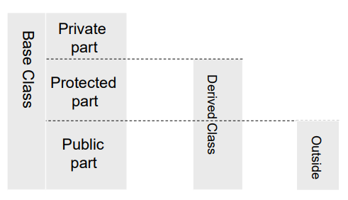
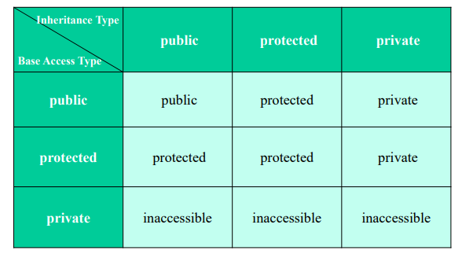

Inheritance Rule
* 모든 base object의 data member는 상속된다.
* 모든 base object의 function member는 상속된다.
(예외) Constructor, destructor, Nonmember functions, Assignment Operator, Virtual methods
* base의 private data와 methods는 derived class에서 접근 불가능 하다.



Inhertied Acces Rules
* Syntax : class derivedClassId : inheritance_type baseClassId

* inheritance type이 public,protected,private인지에 따라 Base class의 type이 어떻게 상속되는지 볼 수 있다. public으로 상속받았을 경우에는 동일하게, protected로 상속받았을 경우에는 public->protected, protected는 유지, private으로 상속받았을 경우에는 public->private , protected->private로 바뀌는 것을 볼 수 있다.

[Overridng vs Overloading]
**Overloading**
같은 이름의 함수이지만, 매개변수의 개수나 타입이 다른 함수로 인식된다.
컴파일 시간에 어떤 함수가 호출될지 결정된됨(정적 바인딩, Static binding)
```c++
class Printer {
public:
    void print(int value) {
        cout << "정수 출력: " << value << endl;
    }

    void print(double value) {
        cout << "실수 출력: " << value << endl;
    }

    void print(string value) {
        cout << "문자열 출력: " << value << endl;
    }
};

int main() {
    Printer p;
    p.print(10);        // 정수 출력
    p.print(3.14);      // 실수 출력
    p.print("Hello");   // 문자열 출력
}

```
**Overriding**
상속관계에서 base class의 가상함수(virtual function)을 파생 클래스에서 같은 시그니처로 재정의하는 것
같은 이름, 같은 매개변수 목록으로 기반 클래스와 파생 클래스에서 모두 사용된다.
런타임에 호출될 함수가 결정됨(동적 바인딩, Dynamic Binding)
```c++
class Animal {
public:
    virtual void sound() const {
        cout << "동물이 소리를 냅니다." << endl;
    }
};

class Dog : public Animal {
public:
    void sound() const override {
        cout << "멍멍!" << endl;
    }
};

int main() {
    Animal* a = new Dog;
    a->sound();  // 멍멍! ← 동적 바인딩으로 Dog::sound() 호출
    delete a;
}

```

**Polymorphism**
분리된 class에서 다양한 version의 함수를 쓸 수 있도록 하는 기능.


[static binding]
컴파일 시점에 호출될 함수가 결정되는 것. 단순히, 포인터의 자료형을 기반으로 호출의 대상을 결정한다.
```c++
class BaseClass {
public:
void print(void) const { cout << “Base class\n”; }
};
class DervClass: public BaseClass {
public:
void print(void) const { cout << “Derived class\n”; }
};
int main(void) {
BaseClass* objPtr = new BaseClass;
objPtr->print(); delete objPtr;
objPtr = new DervClass;
objPtr->print(); delete objPtr;
}
```
[dynamic binding]
런타임에 호출될 함수가 결정되는 것으로, virtual 키워드를 통해 동적 바인딩하는 함수를 가상 함수라고 한다.
함수가 가상 함수로 선언이 되면, 포인터 변수가 실제로 가리키는 객체에 따라 호출의 대상이 결정된다.

```c++
class BaseClass {
public:
virtual void print(void) const { cout << “Base class\n”; }};
class DervClass: public BaseClass {
public:
virtual void print(void) const { cout << “Derived class\n”; }};
int main(void) {
BaseClass* objPtr = new BaseClass;
objPtr->print(); delete objPtr;
objPtr = new DervClass;
objPtr->print(); delete objPtr;
}
```

Virtual destructor
* 상속 구조에서 기본 클래스의 소멸자를 가상으로 설정하면, 파생 클래스의 소멸자가 제대로 호출 될 수 있게 해줌

Pure virtual function
* =0 으로 선언된 가상함수
* 파생클래스에서 반드시 재정의 해야한다.
* 기본 클래스는 인터페이스 역할만 한다.

Abstract class
* 하나 이상의 순수 가상 함수를 가진 클래스
* 인스턴스를 만들 수 없다.
* 파생 클래스가 강제로 오버라이딩 하게 한다.
